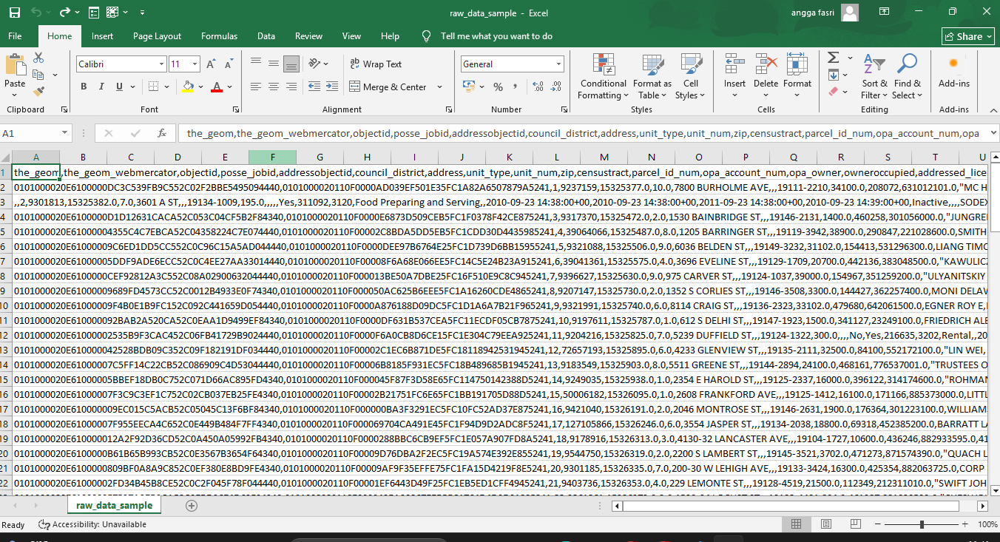
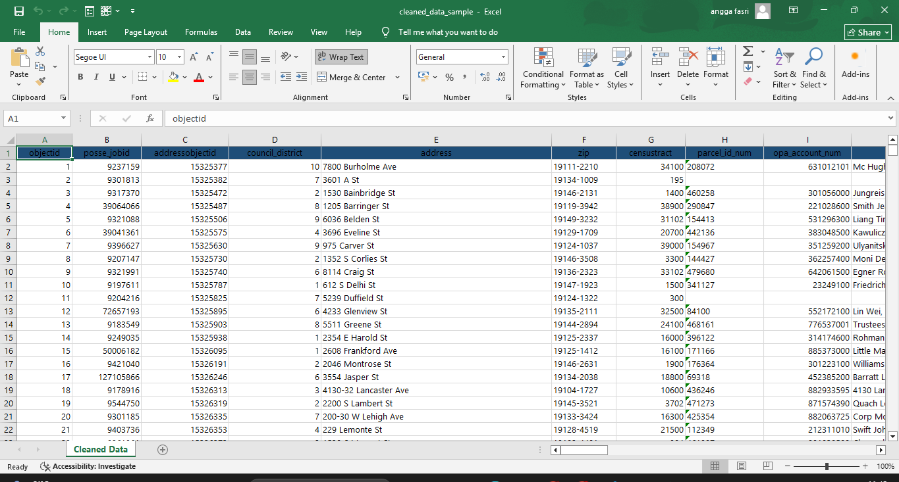

# Automated Data Entry & Cleaning Project

## Overview

An automated Python-based data processing and cleaning pipeline designed to process messy public records. This project demonstrates how Python and Pandas can replace slow, error-prone manual data entry by removing unnecessary metadata, cleaning duplicate entries, standardizing date/text formats, and exporting clean Excel deliverables.

---

## Data Transformation (Before vs After)

### Before (Raw Public Dataset)

The raw dataset contained GIS noise strings (`the_geom`), incomplete columns, floating-point ID numbers, and unformatted uppercase text.



### After (Cleaned & Formatted Deliverable)

Unnecessary coordinate columns removed, dates formatted to `YYYY-MM-DD`, float IDs converted to integers, text standardized to Title Case, and styled with professional Excel formatting (corporate blue headers and auto-fit column widths).



---

## Dataset Information

- **Source:** [Data.gov - Business Licenses Dataset](https://catalog.data.gov/dataset/licenses-and-inspections-business-licenses)
- **Raw File:** `data/raw_data_business_licenses.csv` (~240 MB full raw dataset, stored locally)
- **Sample Input:** `data/raw_data_sample.csv` (100-row sample for GitHub repository)
- **Output Deliverable:** `data/cleaned_data_sample.xlsx` (1,000-row formatted Excel deliverable)

## Key Features & Transformations

- **Noise Reduction:** Automatically removes unwanted GIS/coordinate metadata columns (e.g., `the_geom`, `geocode_x`).
- **Data Filtering:** Drops incomplete columns containing over 80% missing values.
- **Deduplication:** Identifies and removes duplicate records.
- **Type Standardization:** Converts floating-point values and scientific notations into clean integers.
- **Date Formatting:** Standardizes inconsistent date formats with timestamps into clean `YYYY-MM-DD` strings.
- **Text Normalization:** Cleans whitespace and standardizes uppercase text into clean Title Case.
- **Excel Styling:** Applies openpyxl styling with custom headers, borders, and dynamic column auto-fitting.

## Project Structure

```text
python-portfolio/
└── WEB-SCRAPING/
    └── DATA-ENTRY-AUTOMATION/
        ├── screenshots/
        │   ├── before_raw_data.png                   # Raw dataset screenshot
        │   └── after_cleaned_data.png                # Cleaned deliverable screenshot
        ├── data/
        │   ├── raw_data_business_licenses.csv       # Full raw dataset (250MB, local only)
        │   ├── raw_data_sample.csv                  # Generated raw sample (GitHub)
        │   └── cleaned_data_sample.xlsx             # Generated formatted deliverable (GitHub)
        ├── .gitignore                                # Git rules (ignores large datasets)
        ├── cleaner.py                                # Main Python automated cleaning script
        └── README.md                                 # Project documentation
```
